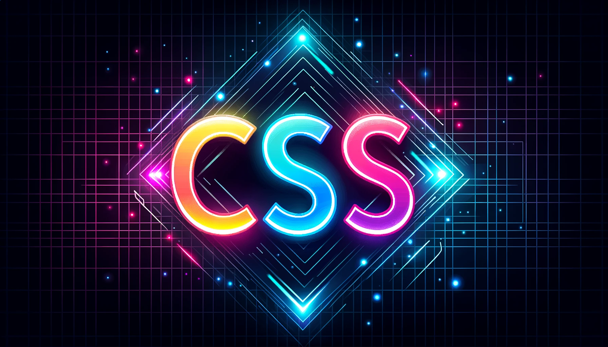

# CSS Full Course for Beginners

I'm using this repository to access code and resources for a comprehensive CSS course that I'm studying as a beginner. The course covers a wide range of topics, starting from basic selectors and extending to advanced subjects like animations and flexbox. 

## Table of Contents

0. Intro
1. Start Here
2. Selectors
3. Colors
4. Units & Sizes
5. Box Model
6. Typography
7. Styling Links
8. List Styles
9. Mini Project
10. Display
11. Floats
12. Columns
13. Position
14. Flexbox
15. Grid Layout
16. Images
17. Media Queries
18. Card Project
19. Pseudo
20. Variables
21. Functions
22. Animations
23. Organization
24. Final Project

## Useful tools
The page [coolors](https://coolors.co/contrast-checker/112a46-acc8e5) contains recommendations to match the of text and background.

The page [Sym](https://symbl.cc/en/) contains a collection of symbols that can be copied and added to html.

The page [W3C CSS](https://jigsaw.w3.org/css-validator/validator) can be used to validate CSS files.

---

### Credits

This course is based on the tutorial by [Dave Gray](https://www.youtube.com/channel/UCY38RvRIxYODO4penyxUwTg). You can watch the full tutorial on [YouTube](https://www.youtube.com/watch?v=n4R2E7O-Ngo&t=11542s).

---

